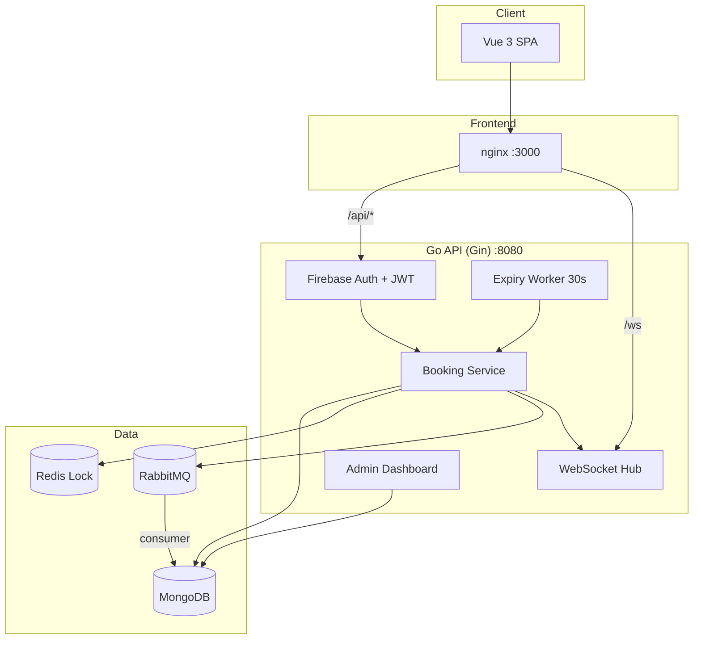

# Cinema Ticket Booking System

Online cinema ticket booking with Redis distributed locking, WebSocket real-time seat updates, RabbitMQ audit pipeline, and admin dashboard.

---

## 1. System Architecture Diagram



**Request path (Docker):** Browser → nginx (`localhost:3000`) → backend API / WebSocket.  
**Local dev:** Browser → Vite (`localhost:5173`) → backend (`localhost:8080`) directly.

---

## 2. Tech Stack Overview

| Layer | Technology | Package / Tool |
|-------|------------|----------------|
| Backend | Go + Gin | `github.com/gin-gonic/gin` |
| Frontend | Vue 3 | Vite, Pinia, Vue Router, Tailwind CSS |
| Database | MongoDB | `go.mongodb.org/mongo-driver` |
| Cache / Lock | Redis | `github.com/redis/go-redis/v9` (distributed lock only) |
| Realtime | WebSocket | `github.com/gorilla/websocket` |
| Message Queue | RabbitMQ | `github.com/rabbitmq/amqp091-go` |
| Auth | Firebase Auth | Google Sign-In → backend JWT (24h) |
| Deployment | Docker Compose | MongoDB, Redis, RabbitMQ, backend, frontend (nginx) |

---

## 3. Booking Flow

| Step | Action | API / Component | Seat status |
|------|--------|-----------------|-------------|
| 1 | User signs in with Google | Firebase popup → `POST /api/auth/login` | — |
| 2 | Browse showtimes | `GET /api/showtimes` | — |
| 3 | Open seat map | `GET /api/showtimes/:id/seats` + WebSocket `/ws` | AVAILABLE |
| 4 | Select seats & confirm | `POST /api/showtimes/:id/seats/lock` | AVAILABLE → LOCKED |
| 5 | Payment page (5 min countdown) | Booking `PENDING`, `expires_at` set | LOCKED |
| 6a | Pay (mock) | `POST /api/bookings/:id/pay` | LOCKED → BOOKED |
| 6b | Cancel | `POST /api/bookings/:id/cancel` | LOCKED → AVAILABLE |
| 6c | Timeout (no pay in 5 min) | Background worker every 30s | LOCKED → AVAILABLE, booking EXPIRED |

**Concurrency rule:** Step 4 acquires a **Redis lock per seat** (`SET NX EX`) before updating MongoDB. If two users race for the same seat, only one gets `201`; the other gets `409 Conflict`.

**Real-time:** After lock/pay/cancel/timeout, the backend broadcasts `SEAT_UPDATE` over WebSocket so all connected clients refresh seat status without reloading.

---

## 4. Redis Lock Strategy

### Key format
```
lock:seat:{showtime_id}:{seat_no}
```

### Acquire (atomic)
```
SET key {uuid-token} NX EX {LOCK_TTL_SECONDS}
```
- **NX** — set only if key does not exist (one winner per seat)
- **EX** — auto-expire after TTL (default 300s = 5 minutes, matches booking window)
- **Token** — random UUID stored as value; required to release safely

### Release (Lua script)
```lua
if redis.call("GET", KEYS[1]) == ARGV[1] then
  return redis.call("DEL", KEYS[1])
else
  return 0
end
```
Only the lock owner (matching token) can delete the key — prevents releasing another user's lock.

### Flow in code
1. `LockSeats` → Redis lock each seat → MongoDB `LOCKED` → WebSocket broadcast
2. `Pay` / `Cancel` / expiry worker → Lua release with stored token → MongoDB updated → broadcast

### Trade-offs
| Choice | Benefit | Cost |
|--------|---------|------|
| Redis lock before MongoDB write | Prevents double booking under concurrency | Two systems to keep in sync; rollback on partial failure |
| TTL on lock | Self-heals if server crashes mid-booking | Seat briefly unavailable until TTL expires |
| Token + Lua release | Safe unlock (no accidental delete) | Must store token per seat on booking document |
| Per-seat lock (not whole showtime) | Higher throughput | More Redis keys per request |

### Proof (Phase 11)
```powershell
cd backend
go test ./internal/booking/ -run "TestConcurrent|TestLock|TestRelease" -v
```
50 concurrent goroutines → exactly **1** lock success. See `internal/booking/lock_test.go`.

---

## 5. RabbitMQ Usage

| Queue | Published when | Consumer action |
|-------|----------------|-----------------|
| `booking.success` | Payment succeeds | Mock email/SMS log + `BOOKING_SUCCESS` audit log |
| `booking.timeout` | Pending booking expires | `BOOKING_TIMEOUT` audit log |
| `seat.released` | User cancels pending booking | `SEAT_RELEASED` audit log |

**Direct audit (no queue):** `SYSTEM_ERROR` written to MongoDB when Redis lock infrastructure fails.

**Message shape:** `BookingEvent { booking_id, user_id, showtime_id, seat_nos }`

**Consumer:** Started in `cmd/server/main.go`; each queue runs in its own goroutine, decodes the event, writes to `audit_logs` collection, and logs a mock notification for `booking.success`.

---

## 6. How to Run

### Prerequisites
- [Docker Desktop](https://www.docker.com/products/docker-desktop/) with WSL2 / virtualization enabled  
  *(or use [Local dev](#local-dev-without-docker) below)*
- Firebase project with Google Sign-In enabled
- `backend/firebase-key.json` — Service Account key from Firebase Console

### Docker (recommended for submission)

```bash
# 1. Clone the repo
git clone <repo-url> && cd cinema-booking

# 2. Firebase service account (not committed — add manually)
#    Place at: backend/firebase-key.json

# 3. Frontend build env for Docker
cp .env.example .env
# Fill VITE_FIREBASE_API_KEY, VITE_FIREBASE_AUTH_DOMAIN, VITE_FIREBASE_PROJECT_ID

# 3b. (Optional) Preflight check — catches missing firebase-key.json before build
.\scripts\docker-preflight.ps1   # PowerShell on Windows
# bash: test -f backend/firebase-key.json && test -f .env

# 4. Start everything
docker compose up --build
```

Open **http://localhost:3000**

Tip: run detached so MongoDB checkpoint logs do not hide backend errors:

```bash
docker compose up -d --build
docker compose ps          # STATUS column: all should be "healthy" or "running"
docker compose logs backend --tail 50   # if frontend never starts, check here first
```

| Service | URL |
|---------|-----|
| Frontend | http://localhost:3000 |
| Backend API | http://localhost:8080 |
| RabbitMQ UI | http://localhost:15672 (cinema / cinema) |
| Health check | http://localhost:8080/health |

On first start, backend **auto-seeds** demo data (movie, showtimes, 100 seats/showtime, admin user) if the database is empty.

### Local dev (without Docker)

Use cloud or local services for MongoDB, Redis, and RabbitMQ (see `backend/.env.example`).

```powershell
# Backend
cd backend
cp .env.example .env          # edit MONGO_URI, REDIS_ADDR, RABBITMQ_URL, etc.
# Place firebase-key.json in backend/
go run ./cmd/server

# Frontend (separate terminal)
cd frontend
cp .env.example .env          # fill Firebase client config
npm install
npm run dev                   # http://localhost:5173
```

### Environment files

| File | Purpose |
|------|---------|
| `backend/.env.example` | Backend server config (MongoDB, Redis, RabbitMQ, JWT, Firebase path) |
| `frontend/.env.example` | Vite dev server (`VITE_API_URL`, `VITE_WS_URL`, Firebase client) |
| `.env.example` (root) | Docker Compose frontend build args only |

### Admin access
Sign in with Google, then set `role: "ADMIN"` on your user in MongoDB `users` collection → sign out/in.  
Or sign in with a Google account whose email matches seeded `admin@cinema.com`.

### Frontend pages

| Page | Route |
|------|-------|
| Login | `/login` |
| Showtimes | `/` |
| Seat map | `/showtimes/:id` |
| Payment | `/bookings/:id/pay` |
| My bookings | `/bookings` |
| Admin | `/admin` (ADMIN role only) |

---

## 7. Assumptions & Trade-offs

### Assumptions
- **Mock payment** — no real payment gateway; `POST .../pay` marks booking as PAID
- **Firebase Google Sign-In** — judges provide their own `firebase-key.json` and Firebase client config
- **Single cinema** — one seat map layout (10×10 grid, rows A–J) per showtime
- **JWT expiry** — 24 hours (`internal/auth/jwt.go`)
- **Booking hold window** — 5 minutes (`LOCK_TTL_SECONDS=300`), checked by worker every 30 seconds
- **Admin RBAC** — `role === "ADMIN"` on JWT + route guard; admin APIs return 403 for USER role
- **No seat map reconnect UI** — WebSocket reconnect on close is a known improvement (see Troubleshooting)

### Trade-offs
| Area | Decision | Why |
|------|----------|-----|
| MongoDB + Redis | Two-phase lock (Redis then Mongo) | Correctness under concurrency > single-DB simplicity |
| RabbitMQ for audit | Async audit logs + mock notifications | Decouples logging from request path; demonstrates MQ usage |
| WebSocket per showtime | Hub groups clients by `showtime_id` | Scales better than one global channel |
| Docker internal services | MongoDB/Redis/RabbitMQ in compose | One-command demo; production would use managed services |
| Seed on startup | Auto-seed if DB empty | Judges can run immediately without manual seed command |
| Vue SPA + nginx proxy | Same-origin API in Docker | Avoids CORS issues on port 3000 |

---

## Testing

### Concurrency (automated)
```powershell
cd backend
go test ./internal/booking/ -run "TestConcurrent|TestLock|TestRelease" -v
```

### Concurrency (live API)
```powershell
.\scripts\concurrency_test.ps1 -ShowtimeId "<showtime-id>" -Token "<jwt>"
```
Expected: **1× 201**, **9× 409**.

### WebSocket (manual)
Open the same seat map in two tabs → lock a seat in tab A → tab B shows LOCKED without refresh.

---

## Troubleshooting

| Problem | Cause | Fix |
|---------|-------|-----|
| **MongoDB keeps logging `WT_VERB_CHECKPOINT`** | Normal WiredTiger checkpoint (not stuck / not an error) | Mongo is fine if `docker compose ps` shows `mongodb` as **healthy**. Backend/frontend block on **backend** health, not these logs |
| **`backend` unhealthy** / dependency failed | Missing or invalid `firebase-key.json`; backend crashes before `/health` | Run `docker compose logs backend`. Ensure `backend/firebase-key.json` exists **as a file** (on Windows, Docker creates a **folder** if the file was missing — delete it and add the real JSON). Run `.\scripts\docker-preflight.ps1` |
| Backend cannot connect to MongoDB in Docker | Using `localhost` instead of service name | Use `mongodb:27017` in compose env |
| Redis lock fails | Redis not ready | Wait for healthcheck; check `REDIS_ADDR` |
| Firebase verify fail | Wrong credentials path | Mount/copy `firebase-key.json`; set `FIREBASE_CREDENTIALS` |
| WebSocket disconnects | No reconnect logic | Refresh page; optional: add `ws.onclose` reconnect |
| RabbitMQ connection refused | Service not ready | Compose `depends_on` + healthcheck |
| CORS error (local dev) | Frontend on :5173, API on :8080 | CORS middleware allows both origins |
| JWT invalid | Wrong secret or expired token | Check `JWT_SECRET`; re-login |
| Docker 500 error | Virtualization disabled in BIOS | Enable VT-x/SVM or use local dev |

---

## Project structure

```
cinema-booking/
├── backend/          Go API (Gin)
├── frontend/         Vue 3 SPA
├── docker-compose.yml
├── scripts/          concurrency test scripts
└── README.md
```
